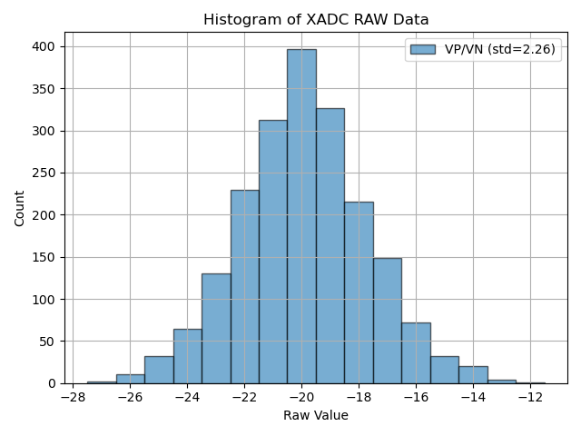

C programs with GCC
===================

Each directory here contains a single C program in a .c file with the same name
as the directory.
To compile and run them please see the individual Makefiles for definitive
information.
Typically, you'll want to do something like this:

    cd hello
    make            # Build binary.
    make transfer   # Use SCP to copy binary onto target.
    ssh zc702       # Get a terminal on target.
    ./hello         # Run binary on target.

Some programs may have other make target/dependency combinations to simplify the
build, copy, ssh, and run process.
These Makefiles are kept very simple by using the implict rules.

xadc
----

Test the FPGA's ADC converter.
    cd xadc
    make            # Build binary.
    make transfer   # Use SCP to copy binary onto target.
    ssh zc702       # Get a terminal on target.
    ./xadc          # Run binary on target.
    exit            # back to host
    make getdata    # acquire XADC data and plot
    make gethist    # acquire XADC data and show histogram

hello
-----

A simple "Hello World!" which has code split over two c files.
This is the first program to attempt building and running.
To get started `make clean && make && make run` should return 0.

realmat
-------

Print information and some analysis on real matrices.
All code is contained in a single file.
This is the second program to attempt running.

This program uses the following features which may be used as examples:

- Reading from files.
- Allocating and freeing memory.
- Recursive function (`determinant()`).
- Parsing command line options with argp.
- Linking to math library (`math.h/libm`).

The file format is simply that column are separated by whitespace and rows are
separated by newlines.

This code is not specific to Zynq/ARM and should build and run without error or
warning on Linux and Windows.

ps7axim
-------

Drive the AXI master ports of the Zynq (`ps7`).
This is useful for peek/poking and linking the host to the PL via the route
host-script -> SSH -> ps7axim -> PL.

Accesses are performed by using `mmap()` and `/dev/mem` to get a pointer to the
memory mapped address of the ports.

This is specific to Zynq as the AXI ports have hard-coded physical addresses
at `0x4000_0000` (port 0), and `0x8000_0000` (port 1), both with a range of 1GB.

This may be used in conjunction with the `vivado/nonproj-led8` bitstream to
control the pattern of the 8 LEDs.
The bitsteam from `projmode-led8` is also usable but does not have a makefile
for easy reproduction.

    # Configure programmable logic with bitstream.
    cd <eg-zc702>/vivado/nonproj-led8
    make bitstream && make transfer && make program

    # Compile ARM linux binary and transfer to zc702.
    cd <eg-zc702>/(gcc|clang)/ps7axim
    make && make transfer

    # Get a terminal on zc702.
    ssh zc702

    # Read/write the addressable LEDs.
    ./ps7axim -w 0x12345678 0   # Set the LEDs to 0x78, full 32b is stored.
    ./ps7axim -r 0              # Read back the stored value (0x12345678).

Read are always executed before writes so this can be used to get the current
value and set a new one in the same command by using both `-r` and `-w`.
